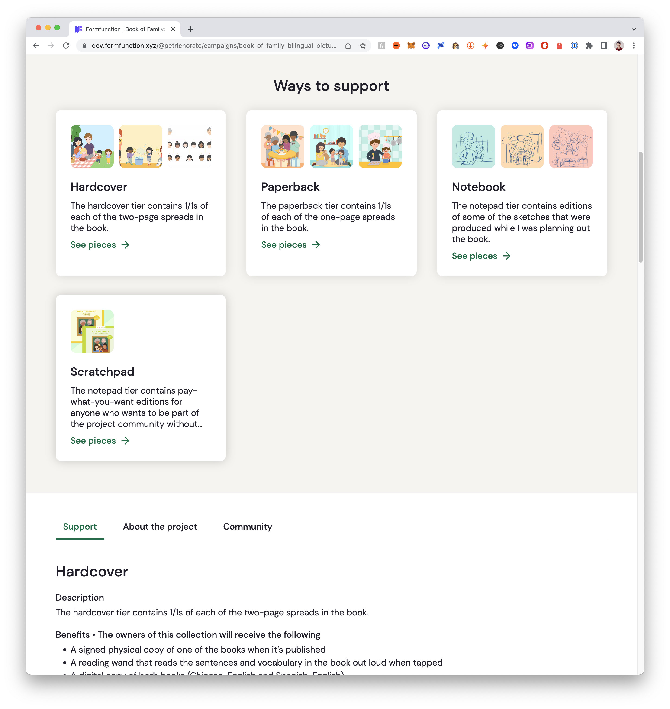
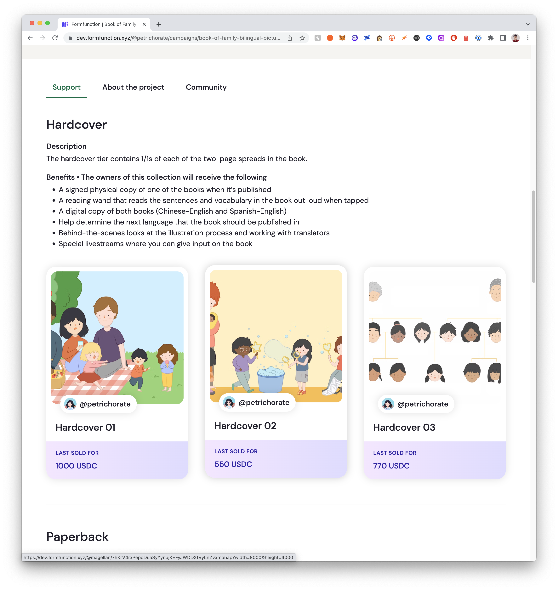

# How Campaigns Work

## Introduction

In this post, we'll go over how the campaigns feature works. But first, what are campaigns?

In short, campaigns are a tool for creators to bring their dream creative projects to life. A Formfunction campaign is similar to a Kickstarter campaign, the main difference being that Formfunction campaigns are funded by NFTs. For more information about the feature, please check out our [blog post](https://www.blog.formfunction.xyz/blog/introducing-campaigns).

## Overview

Campaigns takes all of Formfunction's various features and combines them together in order to let creator's fundraise for their dream projects in a simple but flexible way. 

Here are some screenshots of what a fully funded campaign looks like:

</img> </img> </img>

Here's a high level overview of how the feature works:

- A creator can create a campaign by going to `/@:username/campaigns/create`.
- Each campaign always has one of these statuses. See the [status state machine](#status-state-machine) for more details.
  - Approved—the campaign has been approved by the team.
  - Concluded—the campaign has finished running. The campaign gets assigned this status when the creator manually concludes it. 
  - Draft—the campaign is still being edited, and has not been submitted for approval.
  - Pending—the campaign is waiting for approval.
  - Published—the campaign is live and available for everyone to see and support.
  - Rejected—the campaign has been rejected by the team.
- After creating a campaign, it is in Draft mode. The creator can edit it by going to `/@:username/campaigns/:campaignSlug`. See [campaign valid actions](#campaign-valid-actions) to see what information can be edited when a campaign is in Draft mode.
- Once the creator is ready, they can submit their campaign to be approved. This transitions it to the Pending status. Note that certain information must be filled out before a campaign is allowed to be submitted—see [`CampaignDraftChecklist`](https://github.com/formfunction-hq/formfunction-monorepo/blob/main/packages/frontend/src/components/pages/campaign/edit/CampaignDraftChecklist.tsx) for more details.
- The Formfunction team reviews all pending campaigns, and either approves or rejects them. If a campaign is "perma-rejected", it is deleted. A campaign can also be rejected with feedback, which transitions the campaign back to the Pending status. It can then be resubmitted after feedback is addressed.
- Once a campaign is approved, NFTs can be added to it. At this point, the campaign is still private, and cannot be viewed by anyone except the creator.
- After filling out the pre-requisite information (again, see [`CampaignDraftChecklist`](https://github.com/formfunction-hq/formfunction-monorepo/blob/main/packages/frontend/src/components/pages/campaign/edit/CampaignDraftChecklist.tsx) for more details), the campaign can be published. At this point, the campaign is public and people can start supporting it.
- Formfunction only allows one active campaign at a time. So if a creator wants to make a new campaign, they can [end the current one](https://github.com/formfunction-hq/formfunction-monorepo/blob/main/packages/frontend/src/components/pages/campaign/dashboard/tabs/CampaignDashboardSettingsTab.tsx#L103-L134).

Check out this video for a more in-depth walkthrough.

[](https://www.youtube.com/watch?v=y4kemO0lm8s)


### Status State Machine

Note that rejected campaigns can be re-submitted. When a campaign is rejected, the rejector has the option to give feedback, which will be sent to the creator as an activity notification and in an email.

```
+----------+     +----------+     +----------+
|          |     |          |     |          |
|  Draft   +---->+  Pending +---->+ Approved |
| (Initial)|     |          |     |          |
+----+-----+     +-----+----+     +-----+----+
                       ^                |
                       |                v
              +--------+          +-----+----+
              |                   |          |
              v                   | Published|
     +--------+--------+          |          |
     |                 |          +-----+----+
     |    Rejected     |                |     
     |                 |                v   
     +-----------------+        +-------+--------+
                                |                |
                                |   Concluded    |
                                |                |
                                +----------------+

```

### Campaign Valid Actions

Depending on what status a campaign is in, only certain operations are allowed. For example, NFTs cannot be added to a campaign that is in Draft status. They can only be added once a campaign is approved.

Campaign Status | Draft | Pending | Rejected | Approved | Published | Concluded |
| --- | --- | --- | --- | --- | --- | --- |
| Edit Basic Info (incl. editing teammates) | ✅ | ❌ | ❌ | ✅ | ❌ | ❌ |
| Edit Gallery | ✅ | ❌ | ❌ | ✅ | ✅ | ❌ |
| Edit About Section | ✅ | ❌ | ❌ | ✅ | ✅ | ❌ |
| Submit For Approval | ✅ | ❌ | ❌ | ❌ | ❌ | ❌ |
| Add Funding Tiers | ✅ | ❌ | ❌ | ✅ | ✅ | ❌ |
| Remove Funding Tiers | ✅ | ❌ | ❌ | ✅ | ✅ | ❌ |
| Update Funding Tier NFT Order | ✅ | ❌ | ❌ | ✅ | ✅ | ❌ |
| Update Funding Tier Info | ✅ | ❌ | ❌ | ✅ | ✅ | ❌ |
| Add NFTs | ❌ | ❌ | ❌ | ✅ | ✅ | ❌ |
| Remove NFTs | ❌ | ❌ | ❌ | ✅ | ✅ | ❌ |
| Publish Campaign | ❌ | ❌ | ❌ | ✅ | ❌ | ❌ |

## Codepointers

### Backend

- [`schema.prisma`](https://github.com/formfunction-hq/formfunction-monorepo/blob/main/packages/server/prisma/schema.prisma#L814-L935) contains the data model for campaigns. The `Campaign` table holds most of the information about a campaign. Each campaign has different tiers, represented by `CampaignFundingTier`. Each NFT can belong to at most one funding tier, which is represented by the foreign key `Nft.campaignFundingTierId`.
- [`CampaignsNamespaceQueryResponse`](https://github.com/formfunction-hq/formfunction-monorepo/blob/main/packages/server/src/schema/object/response/campaigns/CampaignsNamespaceQueryResponseGqlType.ts) houses queries for campaigns, and [`CampaignsNamespaceMutationResponse`](https://github.com/formfunction-hq/formfunction-monorepo/blob/main/packages/server/src/schema/object/response/campaigns/CampaignsNamespaceMutationResponseGqlType.ts) houses the mutations.

### Frontend

[This directory](https://github.com/formfunction-hq/formfunction-monorepo/tree/main/packages/frontend/src/components/pages/campaign) holds most of the frontend code for campaigns. Check out [`Routes.tsx`](https://github.com/formfunction-hq/formfunction-monorepo/blob/main/packages/frontend/src/routes/Routes.tsx#L122-L157) to see all the various pages associated with campaigns.

## Treasury Manager

> :warning: **This program was not completed.**


The goal of the [Campaign Treasury Manager](https://github.com/formfunction-hq/formfunction-campaign-treasury-manager) program is to allow for various types of refunds, in order to improve accountability and decrease the risk of rugs.

This goal can be broken down into two objectives.

1. **************************************************************************************************[Priority #1] Offer refunds if a project does not meet its goal**************************************************************************************************. We wanted to do this for similar reasons as [Kickstarter does all-or-nothing funding](https://help.kickstarter.com/hc/en-us/articles/115005047893).
    - “*By not releasing funds unless a project meets its goal, this ensures that **creators have enough money to do what they promised** and they’re not expected to complete a project without the funds necessary to do so. This also **assures backers that they’re only funding creative ideas that are set to succeed**.”*
2. ****************************************************************************************************************************************************************[Priority #2] Release funds incrementally instead of all at once, in order to increase accountability.**************************************************************************************************************************************************************** A common problem with web3 PFP projects is that projects often raise funds and then rug, i.e. they disappear with the funds and never actually build anything. Our goal was to make it harder for projects to rug their communities by releasing funds in phases instead of all at once. For example, if a project meets their fundraising goal, they would receive X% of the funds upfront, and the rest would be disbursed over time (and potentially based on community voting).

The plan was to integrate this program with the [Formfunction Auction House program](https://github.com/formfunction-hq/formfunction-auction-house)—instead of campaign funds going directly to the creator, they would go to an escrow account controlled by the Campaign Treasury Manager program, and would be disbursed based on certain rules. We planned on making this feature opt-in, meaning that the default behavior would be for the funds to go to the creator. This integration and the Campaign Treasury Manager program itself were never completed.
