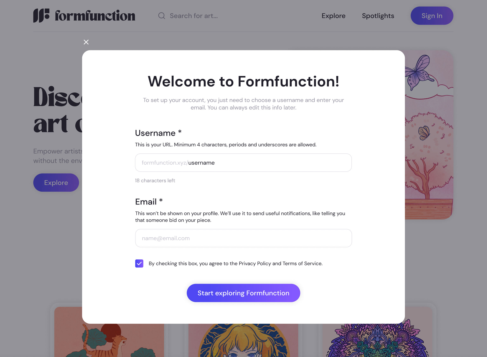
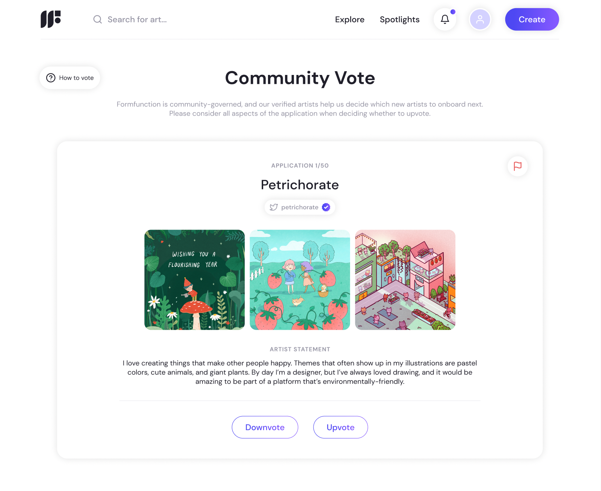
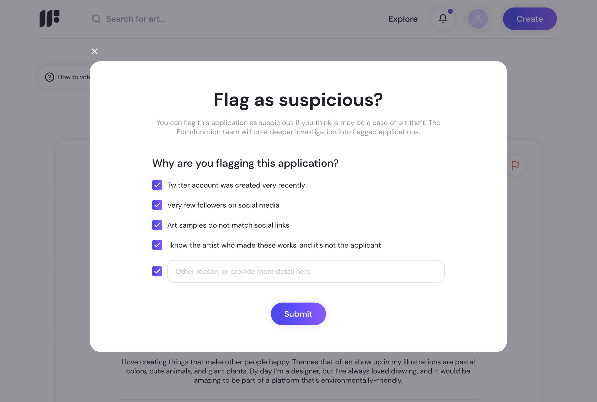
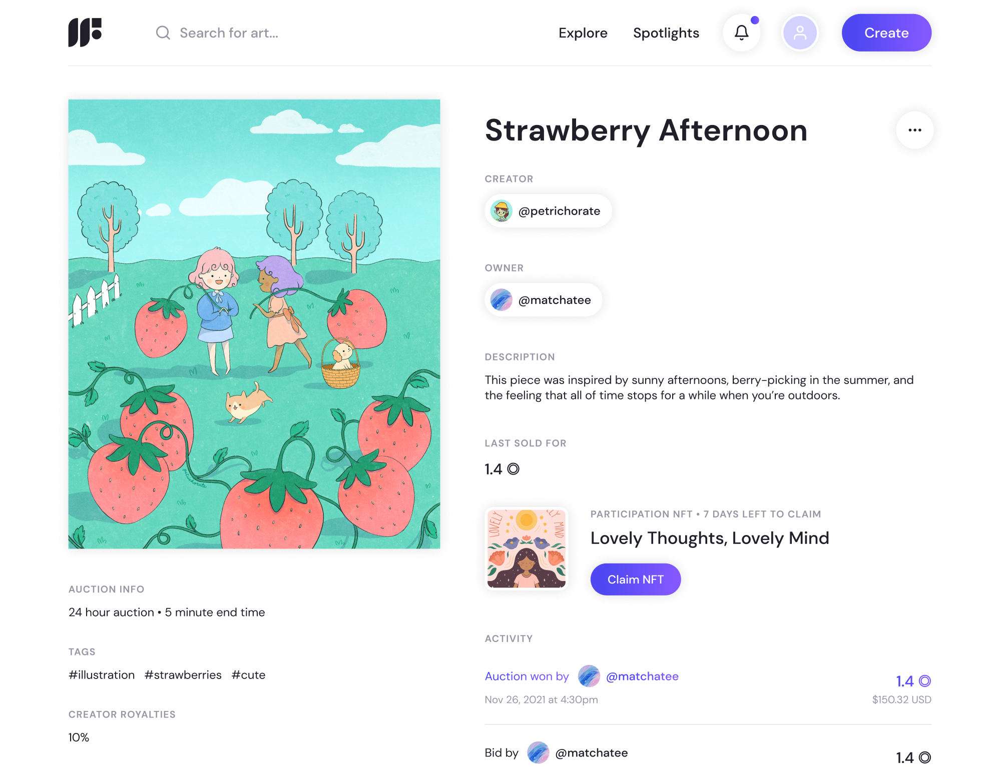
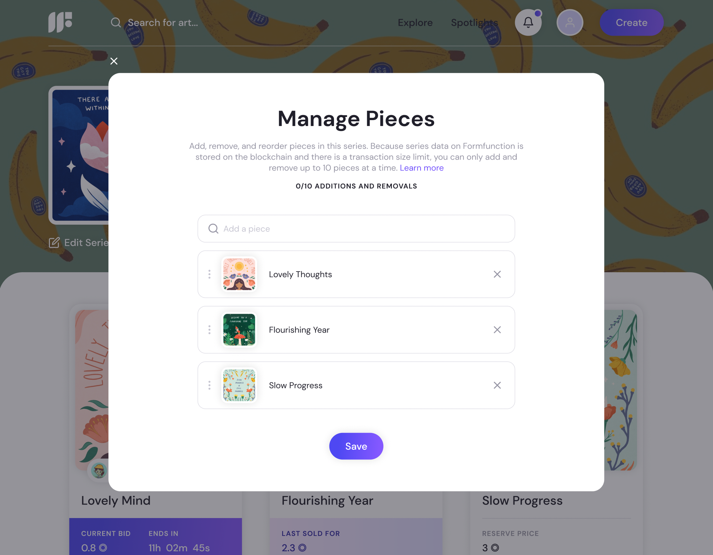

# Designing Formfunction: A UX Case Study

We’re grateful for the amazing feedback we’ve gotten on Formfunction’s design and user experience, and we wanted to share a bit more of our approach here. Although we can’t cover every design decision, this article will walk through a few key examples of our design process as well as potential improvements. We hope that other designers and builders will be able to apply these insights to future product designs in web3 and beyond!

*Note: This article assumes some basic knowledge about crypto and Solana.*

## Streamlining wallet-based signups

Onboarding poses a unique challenge for crypto products. Wallet-based login is an exciting new design paradigm—the wallet acts as a universal identity that can be used by any product.

However, this approach ~~also~~ presents additional UX challenges, and most crypto products must balance the needs of both newcomers and power users:

- Crypto newcomers may be unfamiliar with wallets, including how to download and set one up. They are more accustomed to “web2” experiences that involve email and password signups and email notifications.
- Power users often prioritize anonymity and may be reluctant to share additional information, even if it could improve their user experience.

### Access first, information later

People should be able to explore most of the site without signing in or providing extra information. This lets them see the platform’s value before deciding to engage further.

On Formfunction, for example, people could view live auctions, browse artwork, and visit public profiles without signing in. Only when they wanted to perform an identity-linked action, like bidding on an auction or following a creator, were they prompted to sign in. 

To help those unfamiliar with wallets during the sign-in process, we provided in-context help articles. Although a complete profile involved many different pieces—for instance, a profile picture, cover photo, and social links—we only asked people for the most relevant information (username, email, and agreement to our terms and policies) after they connected their wallet for the first time. This approach allowed users to quickly return to what they were doing and complete their profiles later.

*The signup flow only asks for a username and email, which can be changed later. These two were the most integral pieces of information for making a newcomer’s user experience better.*

We requested usernames and emails during signup to enable platform notifications via email (e.g., winning an auction or gaining a follower), which greatly improved the user experience. However, to further simplify onboarding, we could have limited the initial requirements to just agreeing with our terms and policies.

### Room for improvement

A significant pain point in the current onboarding process was the need for users to not only have a wallet, but also have some crypto in it. Transactions like minting or listing a piece required a small SOL fee, so even though the cost was minimal (a few cents), users couldn’t start with an empty wallet.

After installing the wallet extension and writing down their seed phrase, users had to go to a site like Coinbase, complete their onboarding process, purchase a small amount of SOL, and transfer it to their new wallet. This is a huge barrier to entry!

A few of ideas for improving this process:

- Creating better educational resources on wallet setup (e.g., step-by-step walkthroughs for purchasing SOL through different exchanges and transferring it to a new wallet).
- Giving users to the option sign in with email and password rather than connecting a wallet, so they can use credit card payments with a non-custodial wallet instead. If eventually they want to use a custodial wallet, they could connect it later (similar to [Magic’s product](https://magic.link/auth)).

## Designing our creator onboarding process

Various NFT marketplaces have taken on different methods for onboarding new creators—opening it up to everyone, starting an invitation network, or relying on a curatorial committee. When we first launched, we wanted to start small and grow our community at a sustainable pace while maintaining our core values:

- Community-driven: We wanted our community to shape its own growth, rather than deferring decisions to external critics.
- Accessible: Creators of all backgrounds and experience levels should have a fair chance to join, regardless of whether they already had a network within Solana or NFTs.

### Empowering the community

After lots of thought, we settled on a DAO-like voting system, allowing active community members—artists and collectors—to vote on which artists to onboard next. This process ensured equal visibility for all applicants, regardless of whether or not they already had a network in the ecosystem. 

Voting is a hard problem, and designing the voting system involved careful consideration. Here are just some of factors we took into account:

**Ease of use**

Before we built our voting system, we did a lot of research into different DAO voting and governance websites we could use. But it felt really clunky to ask people to leave Formfunction and connect their wallets to a separate app just to vote.

We knew that the voting process was a critical part of the platform, so we decided to build it directly into Formfunction. This made voting just two clicks away for any creator or collector on the platform, with applications formatted specifically ~~for Formfunction~~ for ease of review.

**Reducing bias**

We considered making voting a Reddit-like view, where you could compare the applications and see which ones were most upvoted. But this would make it really easy to have popularity bias—it was too tempting to just upvote the already popular applications, and get tired of voting before getting to the applications at the bottom.

To ensure equitable voting, we decided to display applications one at a time, in a shuffled order.

**Non-zero-sum approach**

We felt strongly that we didn't want a system like "the top 25% of applications each week get approved.” We didn’t want artists’ approvals to be at the expense of others—so we decided that all applications with a majority vote would be approved.

**Encouraging participation**

We knew that this community-based voting system would be a new concept, so to familiarize people with the system and encourage participation, we organized weekly voting parties through Discord for the first few months.

**Minimizing art theft**

Addressing art theft was a significant challenge, which we tackled through various layers of protection, including manual review and easy reporting options during the voting process. More on this specific issue below!

*A screenshot of our community voting page. Each application was displayed one by one, with easy reporting options accessible from the top right corner.*

### **Minimizing art theft**

Art theft has long plagued the creative industry, and the advent of NFTs has only exacerbated the problem.

To minimize art theft, we took the following measures, which involved a combination of auto-flagging, community reporting, and manual reviewing:

1. We required all applications to connect to a Twitter account. If the Twitter account was created very recently or had very little activity, the application was auto-flagged for manual review. Eventually we took this a step further by adding another layer of manual review which involved checking whether the provided Instagram or website links matched the connected Twitter. Because some artists separated their NFT and non-NFT art identities this was often hard to catch—in some cases, we even reached out to the artist’s Instagram or email to ask if the Twitter belonged to them.
2. Artists and collectors could easily flag and report suspicious applications during the voting process, so the reports could be manually reviewed by our team.
3. We used reverse image searches on submitted content to identify potential matches online. Although not foolproof, tools like Google reverse search and TinEye were useful tools.
4. We maintained a dedicated Discord channel for artists to discuss questionable applications.

All in all, this was a very time-consuming but important process. Despite our efforts, some cases of art theft were nearly impossible to detect. For example, some applications commissioned new artwork that hadn’t been posted online before. In these cases, we had to rely on community reporting.

*Easy reporting flows, built into the voting system. Voters were able to add details to provide evidence of art theft or suspicious activity.*

### Room for improvement

While we are proud of the voting system we designed, we know it had a lot of imperfections. As Formfunction’s creator base expanded to include a more diverse and international audience, we began experimenting with an invite system. 

In the long run, however, we were drawn to the idea of an open platform, where any creator could join and mint their work after passing a simple review process. If we had the chance to go back and revisit any decision, we would have probably implemented this system earlier!

## Improving the experience with contextual information

We aimed to add contextual information throughout Formfunction where it would be helpful, leading to many small design details that made a big difference in the user experience. Context clues gave creators and collectors the relevant details when they needed them, whether it was during the minting flow or while collecting a piece.

A few examples of this approach include:

- Throughout the minting and listing flows, we hid all advanced options within a menu that was un-expanded by default. This allowed the majority of creators to quickly zip through minting and listing with smart default choices that would work for most creators. Meanwhile, power users seeking more flexibility and creativity in their listings could access the advanced options by expanding the menu as needed.
- During the listing process, creators were only shown follow-up steps if selected, such as for participation NFTs (claimable NFTs for all bidders of an auction) and unlockables (extra rewards for the winner of an auction, such as a physical print). This streamlined the flow, making it faster and more comprehensible.
- For listed pieces with an attached participation NFT or unlockable, the corresponding information was displayed on the NFT page. All subsequent steps, like claiming the participation NFT or providing the creator with an email for the unlockable, were also accessible on the same page.
- When collectors purchased a piece that belonged to a campaign, we displayed campaign benefits information within the buy modal.
- When placing bids, collectors could see their wallet balance and the minimum bid amount, so they didn’t need to cross-reference the NFT page or their wallet.

*If a participation NFT was added to an auction, all bidders could see the attached participation NFT on the auction page itself, and claim it there at the conclusion of the auction.*

## Providing helpful error messages

Early on, we faced the challenge of default error messages being difficult to understand. Many errors were associated with on-chain actions, such as transaction sizes being too large to go through. These errors resulted in confusing, technical jargon that was unhelpful for users trying to understand why their actions were failing.

One approach to addressing these issues was placing user limits in response to known blockchain limitations. For example, all series on Formfunction were represented on-chain, which led to seemingly arbitrary constraints around how many pieces could be added or removed from a series at once. If a creator tried to add 15 pieces to a new series at once, for instance, the transaction would just fail, leaving the creator puzzled as to why. To tackle this, we restricted creators from adding or removing more than a few pieces in a single action, and displayed the number limit in the UI so they knew how many more steps they could take. While still not the ideal experience, this prevented creators from running into strange transaction failures.

*When managing pieces in a series, creators were informed of the maximum number of additions and removals, so they wouldn’t encounter strange errors because of transaction size limits.*

Additionally, we put considerable effort into stress-testing our new features, finding all the ways they could fail, and writing more user-friendly error messages for each case. Rather than presenting cryptic messages with blockchain terminology, we displayed error messages in plain English. For instance, instead of an obscure message detailing which block had timed out, people would see something like: “Someone else placed a bid before you could. Please try again.”

## Wrapping up

We hope that this case study offers some insight into the thought process that went into designing Formfunction, striking a balance between more familiar UX patterns and the emerging design patterns of web3. By focusing on key elements such as onboarding, providing contextual details, simplifying complex flows, and delivering helpful error messages, were were able to create a better experience for both newcomers and power users.

While we’re proud of the work we did, we recognize that there is always room for improvement. With the open-sourcing of Formfunction, we’re excited to see more designers and builders build upon the foundation we’ve started, and put their own spin on it. We’re extremely excited to see how the community branches off from Formfunction, and creates more inclusive, accessible, and user-friendly platforms for everyone.